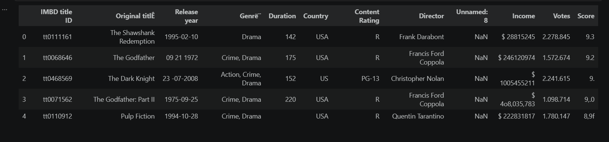
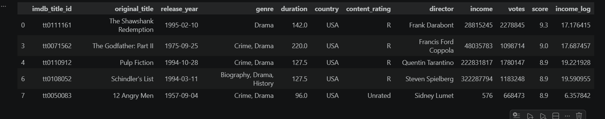

#  Data Cleaning & Preprocessing Project (IMDB Dataset)

##  Overview

Real-world datasets are often incomplete, inconsistent, and noisy, making them unsuitable for direct analysis.
This project focuses on transforming a messy IMDB dataset into a clean, structured, and analysis-ready dataset through a systematic data cleaning pipeline.

---

## Objectives

* Identify and diagnose data quality issues
* Clean and standardize raw data
* Handle missing and inconsistent values
* Convert features into appropriate data types
* Prepare the dataset for analysis and machine learning

---

##  Dataset Description

The dataset contains movie-related information such as:

* Title
* Release Date
* Genre
* Duration
* Country
* Income
* Votes
* Score

However, the dataset contains multiple structural and formatting issues.

---

##  Key Data Issues Identified

* Incorrect delimiter (`;`) leading to parsing errors
* Encoding issues resulting in corrupted text (e.g., `titlÊ`, `Genrë¨`)
* Numerical columns containing symbols, commas, and invalid characters
* Missing values across multiple features
* Inconsistent categorical labels (e.g., `USA`, `US`, `UK `, `Italy1`)
* Presence of malformed and empty rows

---

##  Data Cleaning Approach

The dataset was cleaned using a structured pipeline:

* Applied correct delimiter and encoding during data loading
* Standardized column names for consistency
* Removed irrelevant and empty columns
* Cleaned and converted numerical columns (Income, Votes, Score)
* Standardized categorical values to ensure consistency
* Handled missing values using appropriate imputation strategies
* Removed invalid and incomplete rows

---

##  Before vs After Cleaning

###  Before Cleaning

* Dataset could not be properly parsed due to delimiter issues
* Numerical columns contained non-numeric characters
* Missing values were present
* Categories were inconsistent and duplicated
* Dataset was not suitable for analysis

---

###  After Cleaning

* Dataset successfully parsed and structured
* Numerical columns converted to proper numeric format
* Missing values handled effectively
* Categories standardized across all features
* Dataset reduced from **100 → 89 rows** after removing unreliable records

---

##  Data Validation

After cleaning:

* No missing values remain
* No duplicate rows detected
* All columns have appropriate data types
* Data is consistent and ready for analysis

---

##  Final Result

The cleaned dataset is:

* Structured and consistent
* Free from missing values and duplicates
* Suitable for exploratory data analysis and machine learning

---

##  Tools Used

* Python
* Pandas
* NumPy

---

##  Project Structure

* `cleaning&eda.ipynb` → Data cleaning workflow
* `cleaned_imdb_dataset.csv` → Final cleaned dataset

---

##  Conclusion

This project demonstrates the importance of data preprocessing in real-world scenarios.
Through systematic cleaning and validation, a highly inconsistent dataset was transformed into a reliable dataset ready for analysis and modeling.

---

##  Key Takeaway

> High-quality analysis starts with high-quality data.
> This project highlights the critical role of data cleaning in the data science pipeline.
